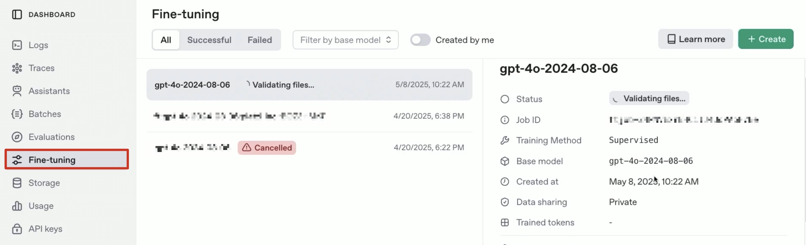
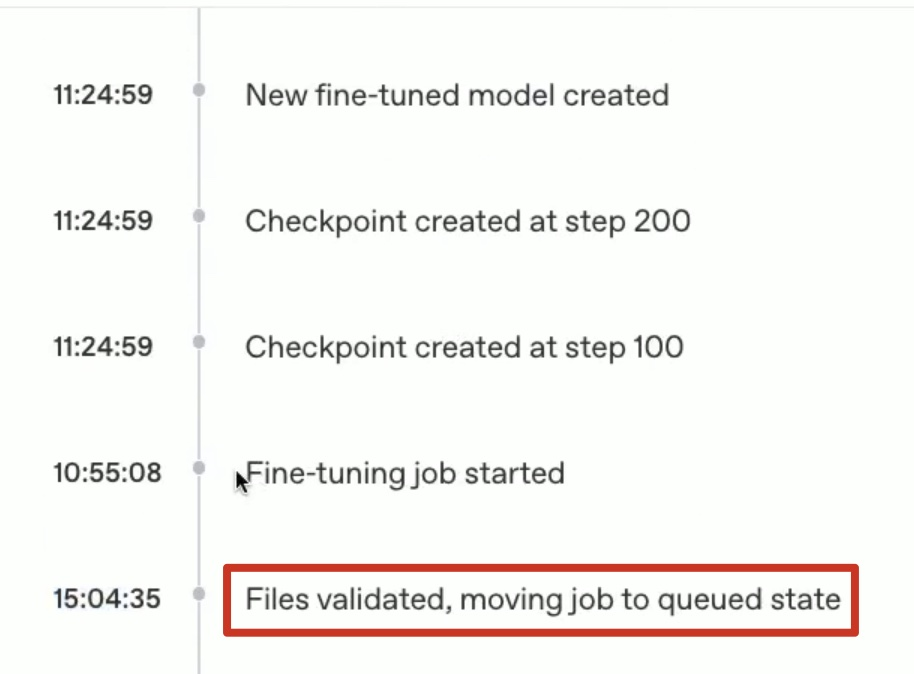

# Fine tuning  supervisado

El fine tuning supervisado significa entrenar un modelo preexistente suministrando claramente tanto el dato como la respuesta esperada. El modelo ajusta sus pesos mediante procesos llamados forward pass y backward pass, procedimientos explicados previamente y esenciales para adaptar el modelo al nuevo contexto.

Esta técnica permite darle al modelo la habilidad de responder preguntas específicas que inicialmente no podría contestar bien debido a la limitación de su entrenamiento original.


## Dataset

Es importante revisar que los datos estén limpios (sin errores, duplicados o inconsistencias), que las entradas y salidas sean claras y estén alineadas (cada pregunta tenga una respuesta adecuada), y que el formato sea compatible con el modelo.


## Fine tuning con OpenIA

Las siguientes líneas muestran un ejemplo de cómo se haría fine tuning con python y la API de OpenIA utilizando un conjunto de datos específico.

## Cargar datos procesados

```{python}
#| eval: false

input_file = "ruta/al/archivo"
dataset = pd.read_json(input_file)

# En este ejemplo, se utilizaron filas específicas para
# reducir el tamaño del dataset
dataset = dataset[dataset['output'].str.len() < 500]
```

## Formatear el dataset

OpenIA recomienda utilizar un formato específico para el fine tuning, esto es utilzando la siguiente estructura:

1. system: la instrucción.
2. user: lo que pregunta el usuario.
3. assistant: como debería responder el asistente.

```{python}
#| eval: false

# Creamos una lista vacia para guardar los mensajes
result = []

# Para cada mensaje del json, crearemos los tres roles necesarios
# y los iremos guardando en la lista result con append
for _, row in dataset.iterrows():
    messages = [
        {"role": "system", "content": row['instruction']},
        {"role": "user", "content": row['input']},
        {"role": "assistant", "content": row['output']}
    ]
    result.append({"messages": messages})
```

Una vez que tenemos el dataset formateado, debemos guardarlo en un formato específico: JSON Lines, donde cada elemento de la lista se interpreta como un registro único.

Es importante splitear el archivo en un conjunto de datos de prueba, y otro conjunto de entrenamiento

```{python}
#| eval: false

# Por terminos practicos de tiempo y costo, seleccionamos solo las
# primeras 500 filas
data_to_finetune = result[:500]

# Para guardar en formato JSONL (JSON Lines) el conjunto de datos
# de entrenamiento
with open('./train_formatted_dataset.jsonl', 'w', encoding='utf-8') as f:
    for item in data_to_finetune:
        f.write(json.dumps(item, ensure_ascii=False) + '\n')


# Seleccion de casos para el conjunto de prueba
data_to_finetune = result[501:1000]

# Para guardar en formato JSONL (JSON Lines) el
# conjunto de prueba
with open('./test_formatted_dataset.jsonl', 'w', encoding='utf-8') as f:
    for item in data_to_finetune:
        f.write(json.dumps(item, ensure_ascii=False) + '\n')
```


## OpenIA desde python

Para usar los servicios de OpenIA desde python debemos tener una API Key. Esta la guardamos en nuestro entorno, y la llamamos usando la librería `dotenv` y la función `load_dotenv`.

Luego, generamos una conexión al cliente.

```{python}
#| eval: false

# Importar librerias
import os
from dotenv import load_dotenv

# Accedemos a nuestra API Key
load_dotenv()
api_key = os.getenv("OPENAI_API_KEY")

# Conexion con OpenAI usando la libreria
from openai import OpenAI

# Guardamos la conexion en client
client = OpenAI(api_key = api_key)
```

Una vez que tenemos una conexión, hay que subir los archivos de train y de test a OpenIA.

::: {.callout-important}
Debemos definir el propósito de los datos que estamos creando, para este caso, un `fine-tune`
:::

Al subir los archivos, OpenIA nos entregará Ids únicos para cada dataset cargado.

```{python}
#| eval: false

# Subir el archivo de entrenamiento
train = client.files.create(
  file = open("train_formatted_dataset.jsonl", "rb"),
  purpose = "fine-tune"  # PORPOSITO
)

# Subir el archivo de pruebas.
test = client.files.create(
  file = open("test_formatted_dataset.jsonl", "rb"),
  purpose = "fine-tune"  # PORPOSITO
)
```

Una vez que subimos los archivos a los servidores, viene la última parte, crear un job de fine tuning en los servicios de OpenIA, es decir, es un proceso en la nube, ya habríamos terminado con el código

```{python}
#| eval: false

# Generamos un "job" de fine tuning
job = client.fine_tuning.jobs.create(
    training_file = "file-JqgvG1NAVf19w5bQeJ76Nw",    # ID generado anteriormente
    validation_file = "file-V7jgUevqPnJ1sHvYbq5PQ2",  # ID generado anteriormente
    model = "gpt-4o-2024-08-06",   # Modelo base al que haremos fine tuning
    method = {
        "type": "supervised",   # Metodo del fine tuning
        "supervised": {         # Este metodo tiene ciertos hiperparametros
            "hyperparameters": {
            "batch_size": "5", # depende del problema, es un trade-off entre eficiencia en el uso de recursos y el performance del modelo.
            "learning_rate_multiplier": "0.001", # Recomendado de 0.0001-10
            "n_epochs": "auto",
          }
        },
    },
)
```

## OpenIA desde platform

Podremos ver el proceso del job en la página OpenIA (no en la página de chatgpt). Obtendremos una vista como esta, donde hallaremos las características de nuestro fine tuning.



Este proceso consta de varias etapas, comenzando por la validación de los datos de entrenamiento y prueba. Una vez finalizada esta fase, se inicia el entrenamiento del modelo utilizando la información proporcionada. La duración total del procedimiento depende tanto del volumen de datos cargados como de la disponibilidad de los servidores de OpenIA, ya que en ocasiones puede haber una lista de espera para la ejecución de los trabajos.

En este ejemplo, OpenIA nos lanzó a una cola de casi 16 horas.



Una vez que se terminó el proceso de fine tuning, OpenIA nos entrega méticas respecto a la calidad del modelo.

1. Trained tokens: número de tokens que se utilizaron para crear el fine tuning. Este número es importante, pues nos indica cuánto nos van a cobrar por el procedimiento.

2. Hiperparámetros: aquí deberíamos ver los mismos que definimos al momento de crear el job, a excepción del Epoch, que lo definió OpenIA y la seed o semilla.

3. Checkpoint: OpenIA realiza puntos de guardado durante el proceso, y se puede "probar" el modelo en cada uno de ellos. Muy útil para ver cambios entre pasos.

4. Train loss: representa el error promedio que comete el modelo sobre el conjunto de datos de entrenamiento durante el proceso de ajuste. Es una medida de qué tan bien el modelo está aprendiendo a predecir las respuestas correctas para los ejemplos que ha visto. Un valor bajo de train loss indica que el modelo está ajustando sus parámetros correctamente y está logrando predecir bien las salidas esperadas en el entrenamiento; un valor alto sugiere que el modelo aún comete muchos errores.

5. Valid loss: representa el error promedio que comete el modelo sobre el conjunto de datos de validación, es decir, sobre ejemplos que no ha visto durante el entrenamiento. Sirve para evaluar qué tan bien el modelo generaliza a datos nuevos y desconocidos. Un valor bajo de valid loss indica que el modelo está aprendiendo correctamente y no solo memorizando los datos de entrenamiento; un valor alto puede señalar problemas de sobreajuste o que el modelo no está captando bien el patrón de los datos.

6. Full valid loss: representa el error promedio del modelo sobre todo el conjunto de datos de validación, considerando todas las muestras y posibles checkpoints del entrenamiento. Es útil para tener una visión global de cómo el modelo se desempeña en datos que no ha visto, y ayuda a comparar el rendimiento entre diferentes etapas del entrenamiento. Un valor bajo de full valid loss indica buena capacidad de generalización; un valor alto puede señalar problemas de sobreajuste o que el modelo no está aprendiendo correctamente los patrones del conjunto de validación.

7. Accuracy:  indica el porcentaje de respuestas correctas que el modelo genera en el conjunto de prueba, comparando las respuestas esperadas con las obtenidas. Es una medida de qué tan bien el modelo predice correctamente en ejemplos que no ha visto durante el entrenamiento. Un valor alto de accuracy significa que el modelo generaliza bien y responde correctamente en la mayoría de los casos; un valor bajo indica que el modelo comete muchos errores en datos nuevos.

