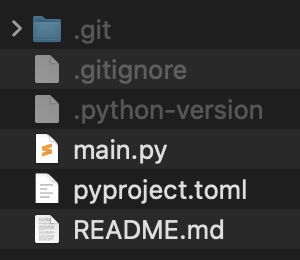

# UV

uv es una herramienta moderna y ultrarrápida para la gestión de entornos virtuales y dependencias en proyectos Python, diseñada para reemplazar y mejorar el rendimiento de utilidades tradicionales como pip, pip-tools o pipenv. 

Entre sus principales ventajas destacan una velocidad de instalación y resolución de dependencias significativamente superior, una integración sencilla con diferentes formatos de archivos de dependencias (como requirements.txt y pyproject.toml), así como la capacidad de crear y administrar entornos virtuales de forma eficiente. 

Esto permite a los desarrolladores ahorrar tiempo en la configuración y gestión de sus proyectos, optimizando tanto flujos de trabajo individuales como de equipos, y garantizando una experiencia más fluida y productiva en el desarrollo con Python.

## Poyecto general con uv

UV proporciona una herramienta que, al ejecutarse, crea los archivos básicos para comenzar un proyecto de python.

::: {.callout-tip appearance="simple"}
## Comando para crear el proyecto

`uv init`
:::

## Entornos virtuales

Otra característica principal de uv es poder facilitar la creación de entornos virtuales.

::: {.callout-tip appearance="simple"}
## Creación de entornos virtuales

`uv venv`: este comando crea el entorno virtual ".venv" por defecto.  
`uv venv nombre_entorno`: podemos asignar un nombre en específigo a nuestro entorno virtual.  
`uv venv --python x.yz`: podemos designar una versión específica de python (si no la tenemos, la descarga).
:::

## Instalación de paquetes

En el contexto de uv, existen los comandos `uv pip install` y `uv pip add`. Ambos sirven para instalar dependencias, pero su comportamiento y propósito tienen diferencias importantes, especialmente cuando trabajas con proyectos gestionados con pyproject.toml (el enfoque moderno).

::: {.callout-tip appearance="simple"}
## uv pip install vs uv pip add

`uv pip install`: si le pasas un nombre de paquete, lo instala, pero no lo añade automáticamente al archivo pyproject.toml (ni a requirements.txt).  

`uv pip add`: instala el paquete y lo agrega automáticamente como dependencia en el archivo pyproject.toml
:::

## Ejecución de scripts

También podemos ejecutar scripts de python sin tener que inicializar el entorno virtual, pues uv lo hace por debajo.

::: {.callout-tip appearance="simple"}
## Ejecución de scripts

`uv run pytest`
:::

